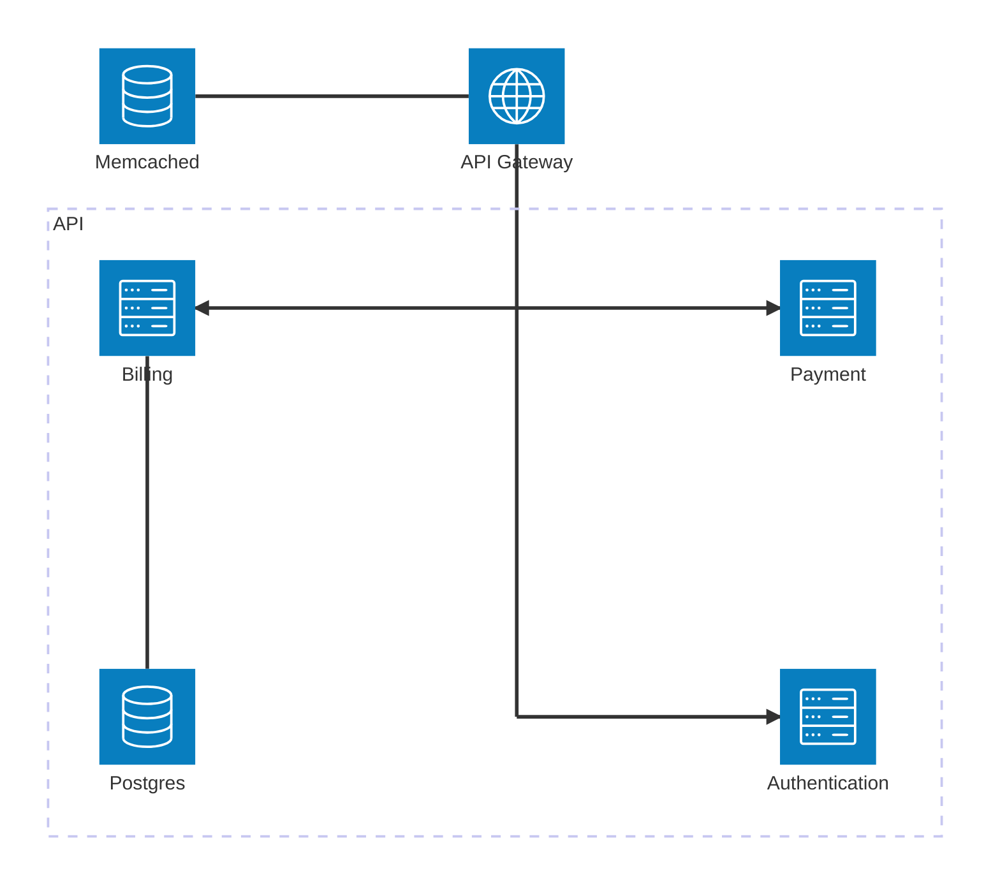

# Сервис по симуляции оплаты услуг ЖКХ

## Схема взаимодействия микросервисов



Список сервисов:

* Сервис аутентификации - регистрирует пользователя и выдает ему токен, по которому он может взаимодействовать с остальными сервисами
* Сервис выставке счётов - позволяет выставлять счёта, просматривать их общих список, удалять их из базы данных
* Сервис оплаты счётов - позволяет оплачивать счёта, поверять состояние платежа
* API-шлюз, через который и происходит общение со всеми микросервисами

Сервис аутентификации хранит данные пользователей с помощью SQLite, сервис по выставке использует для хранения счётов PostgeSQL. API-шлюз же используют Memcached для хранения черного списка вышедших пользователей(их токенов).

## Технологический стек

### Веб-фрейморки

* [Gin](https://github.com/gin-gonic/gin) - высокопроизводительный фреймворк, предназначенный для создания веб-приложений
* [gRPC](https://grpc.io/) - фреймворк для быстрой и бесперебойной связи микросервисов между собой

### Авторизация

* [jwt-go](https://github.com/golang-jwt/jwt) - Библиотека для генерации JWT
* [crypto](https://pkg.go.dev/golang.org/x/crypto) - Стандартная библиотека для шифрования

### Базы данных

* [SQLite](https://github.com/glebarez/go-sqlite) - встраиваемая легковестная СУБД (используется для хранения данных пользователей)
* [PostgeSQL](https://github.com/lib/pq) - мощная и популярная СУБД (используется для хранения счётов)
* [Migrate](https://github.com/golang-migrate/migrate) - библиотека для написания миграций баз данных

### Тестирование

* [Testify](https://github.com/stretchr/testify) - библиотека для эффективного написания тестов на Go

## Сборка и запуск

### 1. Клонирование репозитория с подмодулями

```bash
git clone --recurse-submodules https://github.com/iskanye/utilities-payment.git
cd utilities-payment
```

Если репозиторий был склонирован без подмодулей, выполните:

```bash
git submodule init
git submodule update
```

### 2. Сборка

Для сборки потребуется установленный [Docker](https://www.docker.com/).

**`ВАЖНО`**: Заранее при сборке установите значение параметров окружения `AUTH_SECRET`, `POSTGRES_USER`, `POSTGRES_PASSWORD` и `POSTGRES_DB` для корректной работы сервиса, например:

```bash
export AUTH_SECRET="SUPER-SECRET"
export POSTGRES_USER="postgres"
export POSTGRES_PASSWORD="postgres"
export POSTGRES_DB="postgres"
```

Или в среде Powershell:

```powershell
$Env:AUTH_SECRET="SUPER-SECRET"
$Env:POSTGRES_USER="postgres"
$Env:POSTGRES_PASSWORD="postgres"
$Env:POSTGRES_DB="postgres"
```

После выполните следующую команду для сборки сервисов:

```bash
docker compose build
```

### 3. Запуск

Для запуска сервисов выполните:

```bash
docker compose up
```

После запуска с сервисом можно будет работать по адресу `localhost:8080`

## Эндпоинты

При ошибке запроса возвращает `err` - текст ошибки

|Метод|Путь|Описание|Тело запроса|Ответ|
|-----|----|--------|------------|-----|
|`POST`|`/users/register`|Регистрация пользователя|`email` - email пользователя, `password` - пароль пользователя|`id` - id пользователя|
|`POST`|`/users/login`|Вход в систему|`email` - email пользователя, `password` - пароль пользователя|`token` - уникальный токен пользователя|
|`POST`|`/users/logout`|Выход из системы|-|-|
|`GET`|`/bills/{id}`|Получение счёта по его ID|-|`ID` - ID счёта, `Address` - адрес дома, на который выставлен счёт, `Amount` - сумма счёта, `UserID` - ID пользователя, которому назначен счёт, `DueDate` - до какой даты надо заплатить счёт|
|`GET`|`/bills/`|Получение счётов текущего пользователя|-|`ID` - ID счёта, `Address` - адрес дома, на который выставлен счёт, `Amount` - сумма счёта, `UserID` - ID пользователя, которому назначен счёт, `DueDate` - до какой даты надо заплатить счёт|
|`POST`|`/bills/pay`|Оплатить счёт|`id` - ID счёта|-|
|`POST`|`/admin/bills`|Выставить счёт|`address` - адрес, по которому будет выставлен счёёт, `amount` - сумма счёта, `user_id` - ID пользователя, которому выставляется счёт|`id` - ID счёта|
|`GET`|`/admin/users`|Получить список всех пользователей|-|`ID` - ID пользователя, `Email` - email пользователя, `PassHash` - хеш пароля, `IsAdmin` - является ли пользователь админом|
